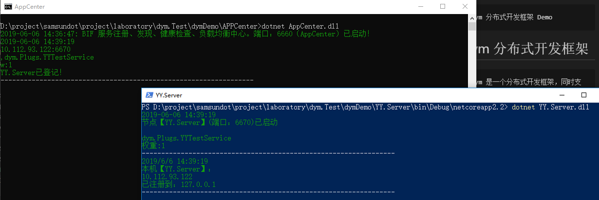
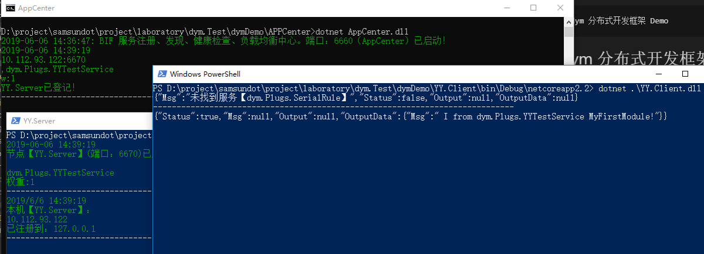

# dymDemo
    dym 分布式开发框架 Demo

# dym 分布式开发框架

    dym 是一个分布式开发框架，同时支持 .net core2.2 、.net frameworker4.6.1。

## 1、运行Demo
    第一步：启动注册中心
        进入项目文件夹 dymDemo\APPCenter ，运行命令 dotnet AppCenter.dll
        看到下图 说明运行成功

    第二步：启动Server  
        Server可以和 AppCenter 不在同一台电脑，也可以运行多个server 也可以负载均衡，高级用法随后介绍
        进入项目文件夹 dymDemo\YY.Server\bin\Debug\netcoreapp2.2 ，运行命令 dotnet YY.Server.dll
        看到下图 说明 Server 成功运行 并且已经注册到 注册中心（APPCenter）运行成功

    第三步：启动Client
        启动Client 测试 Client调用 Server是否成功
        进入项目文件夹 dymDemo\YY.Client\bin\Debug\netcoreapp2.2 ，运行命令 dotnet YY.Client.dll
        看到下图 说明 Client 成功运行 
